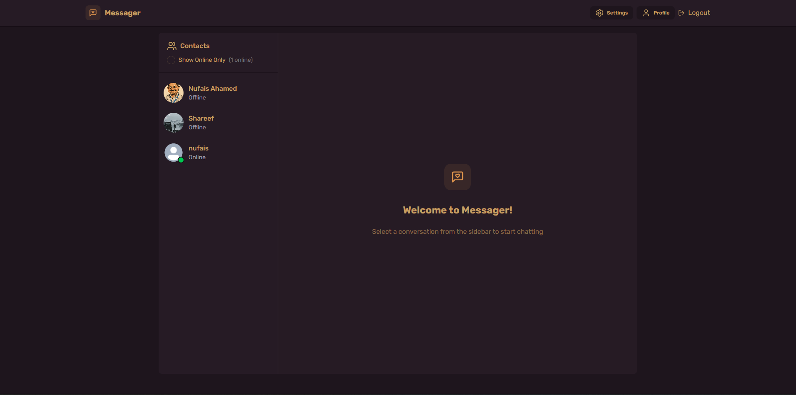

# 📬 Message Web Application

A real-time messaging web application built using **React**, **Tailwind CSS**, **Node.js**, and **Socket.IO**. This app allows users to register, log in, and communicate instantly with one another in a clean and responsive interface. It includes secure authentication using **JWT** and **bcrypt**, and manages state efficiently using **Zustand**.

---

## 🚀 Features

- 🔐 **Authentication** using JWT and bcrypt  
- 💬 **Real-time messaging** with Socket.IO  
- 📜 **Chat history** with timestamps  
- 🎨 **Responsive UI** using Tailwind CSS  
- ⚛️ **State management** with Zustand  
- 📪 **RESTful API** tested via Postman  
- 🔒 Secure password storage  
- 👥 User registration and login  
- 📤 Logout and session management  

---

## 🛠️ Tech Stack

### Frontend:
- React  
- Tailwind CSS  
- Zustand

### Backend:
- Node.js  
- Express.js  
- Socket.IO  
- JWT  
- bcrypt  

### Tools:
- Postman (for API testing)

---

## 🧪 API Testing

All REST API endpoints are tested and verified using **Postman**, including:
- User Registration  
- Login  
- Fetching chat history  
- Sending and receiving messages in real time

---

## 📸 Screenshot

